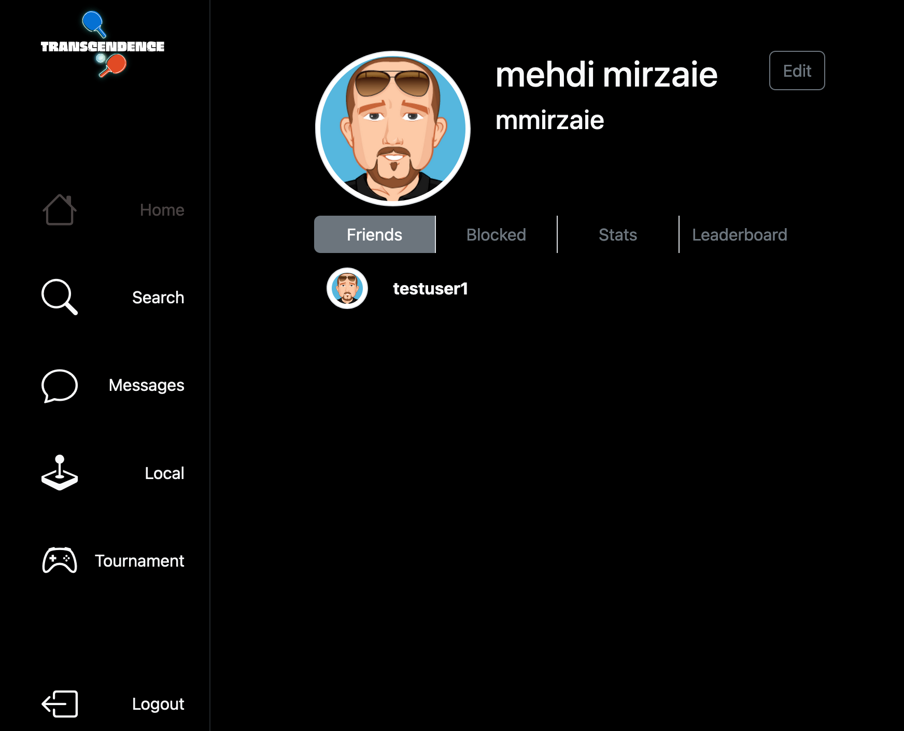
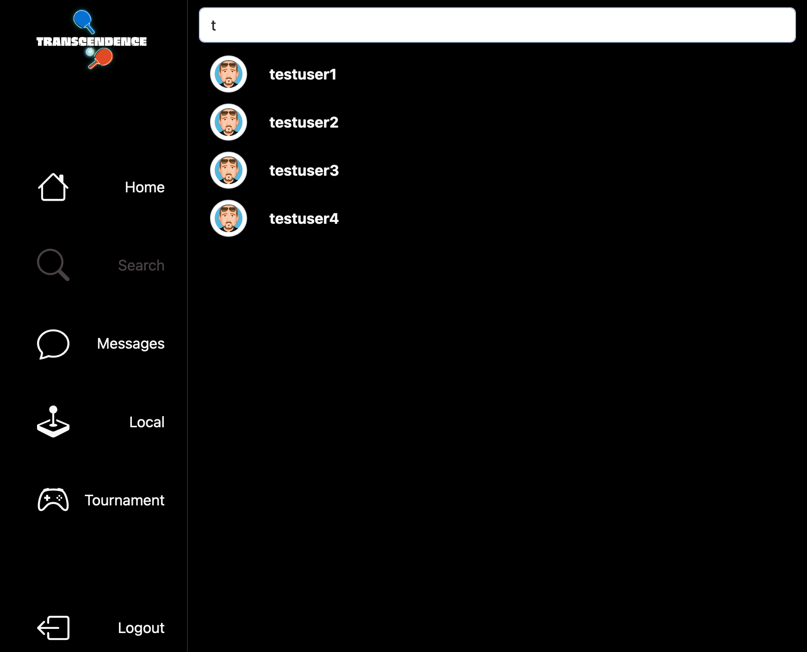

[](https://git.io/typing-svg)

# :sparkles: What is This Project?
The aim of this project was to create a full stack applicaiton, with the following requierments:
<ul>
    <li>Responsive for all screen sizes</li>
    <li>Pong single, and multiplayer</li>
    <li>Block chain, to store multiplayer game results</li>
    <li>OAuth 2, for user authentication</li>
    <li>Live chat, one-to-one, and groups</li>
    <li>Enable users to update their profiles</li> 
</ul>

# Samples
</img>
</img>
</img>
</img>
</img>
</img>
</img>
</img>
</img>
</img>

# :computer: This Project Tech Stack
<div style="display: flex; align-items: flex-start;"></div>

# :construction_worker: How to Run
```bash
$ git clone ....repo...

# *************COMMANDS************ #
# run - run compile all the libtest with the your libft and run the all tests
$ make all

$ ./webserv <optional args {config/...}\>

```

# :bug: Issues

Please feel free **to create a new issue** with its title and description on the issues page of the [webserv](https://github.com/MehdiMirzaie2/42-webserv/issues) Repository. If you have already found the solution to the problem, **I would love to review your pull request**!


To help me out, and if you think this repo is helpful give ⭐️
